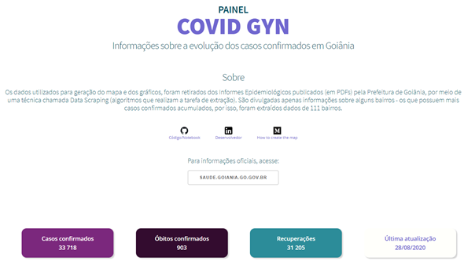

<div align="center">
<h1> Painel COVID GYN</h1>
<p>Informações sobre a evolução dos casos confirmados em Goiânia</p>
<br>
painel-covid-goiania.herokuapp.com
<br>
<br>
<p align="center">
  <a href="#about">Sobre o projeto</a>&nbsp;&nbsp;&nbsp;|&nbsp;&nbsp;&nbsp;
  <a href="#tech">Tecnologias</a>&nbsp;&nbsp;&nbsp;|&nbsp;&nbsp;&nbsp;
  <a href="#get">Execução</a>&nbsp;&nbsp;&nbsp;|&nbsp;&nbsp;&nbsp;
  <a href="#contribute">Como contribuir</a>&nbsp;&nbsp;&nbsp;|&nbsp;&nbsp;&nbsp;
  <a href="#creator">Criador</a>
</p>


</div>

<a id="about"></a>
## Sobre o projeto


<a id="get"></a>
## Execução

**Você pode acessar este projeto clicando [aqui](https://painel-covid-goiania.herokuapp.com/)**
### Antes de executar 
Crie uma conta em  ```www.mapbox.com```. Com a conta criada, gere um token em ```account.mapbox.com/access-tokens```. Copie o token e substitua _YOUR_KEY_ em ```config.ini```.

### Como executar

1. Utilizando um terminal, vá para a pasta que deseja copiar o projeto:


```console
$ cd suapasta
```

2. Copie este projeto para seu repositório local:

```console
$ git clone https://github.com/wendelmarques/painel-covid-goiania.git
```

3. Acesse seu repositório local:

```console
$ cd painel-covid-goiania
```

4. Com o interpretador Python configurado, execute a instalação das bibliotecas:

```console
$ pip install -r requirements.txt
```
5. Acesse a pasta scripts:

```console
$ cd scripts
```
5. Ao dar esse comando, um arquivo pickle (_.p_) será gerado. Ele fica na pasta ../data/pickle/.

```console
$ cd cria_mapa_e_grafico.py
```

6. Volte para a pasta principal:

```console
$ cd ../
```
7. Rode o app
```
$ app.py
```
8. Por fim, acesse:
```
http://localhost:8050/
```

<a id="tech"></a>
## Tecnologias

Para desenvolver este projeto eu usei as seguintes tecnologias:

- 
- 
- 
- 

<a id="features"></a>
## Features

<a id="contribute"></a>

## Como contribuir para o projeto

1. Faça um **fork** do projeto.
2. Crie uma nova branch com as suas alterações: `git checkout -b my-feature`
3. Salve as alterações e crie uma mensagem de commit contando o que você fez: `git commit -m "feature: My new feature"`
4. Envie as suas alterações: `git push origin my-feature`


<a id="creator"></a>
## Criador


[](https://www.linkedin.com/in/wendelmarques/) 
[](mailto:wendelmarquesjs)
